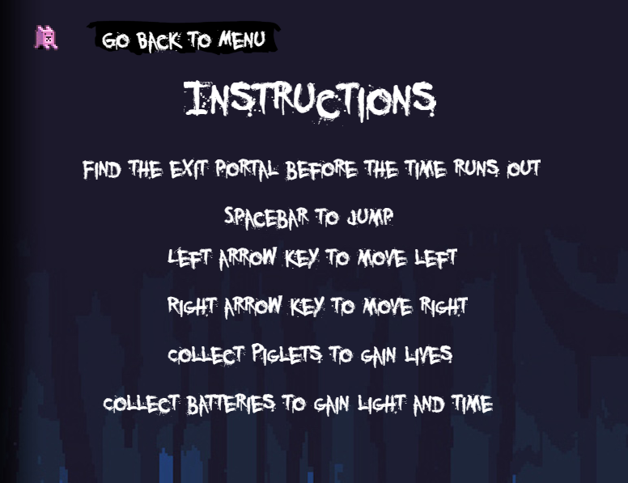

# Wasteland
by Nick Jones, Jamie Wang, Paton Vinal, Kyle Szeto  

## Production App
http://wasteland-adventure.herokuapp.com/

## Description
We made this game because we were passionate gamers and were motivated to make a game. We also believe that making a game is a good way to learn programming. The objective of the game is shown below.

## Objective of Game
The character is trying to avoid monsters in order to escape the wasteland. This may sound easy, but there is a catch! The character will need to collect batteries for his flashlight in order to see through the dark creepy wasteland.

## Technology Used
**FrontEnd**: HTML, Phaser, Javascript  
**BackEnd**: NodeJS, Express, MongoDB, Mongoose, Mlab  
**Deployment**: Heroku  

## Documentation of API
* **GET** http://wasteland-adventure.herokuapp.com/api/topScores  
  * This allows you to get the top 10 highscores in sorted order from the database  
  * This is used to display the top 10 highscores in sorted order on the highscores page  
* **POST** http://wasteland-adventure.herokuapp.com/api/topScores  
  * If there are 10 or more entries in the database, the POST will allow you to remove the lowest score from the top 10 highscores and allow you to add the new highscore to the database.  
  * If there are less than 10 entries in the database, the POST will allow you to add the new highscore to the database.
  * This is used in the Victory and GameOver Page when your score is higher than the current lowest score from the top 10 highscore list.  

## How to Use our code
* Fork it to your Repo
* Git clone the Repo link
* Move into the project directory: `cd ~/YOUR_PROJECTS_DIRECTORY/YOUR_PROJECT_NAME`
* Make sure you do a `npm install` in the server folder before doing anything
* Run `npm run dev` in order to build the production app
* Type `localhost:8080` in your web browser and it should up and running locally.

**Note** You will need to close the current server that is running and run `npm run dev` everytime you make a change.  

## Phaser Documentation 
https://phaser.io/docs/2.6.2/index

## Screenshots
#### Loading Screen  
When you start the website, the loading screen appears and completes only when it finish preloading every sprite, background, and music we used in the game.  
  

#### Menu Screen  
Once the game finish loading, you are directed to the menu screen! You will have the option to play the game, see the game instructions, and see current highscores  
  

#### InfoModal Screen  
If you selected the InfoModal Option, you will see the game instructions. You can click on the top left button to go back to Menu screen  
  

#### Highscores Screen  
If you selected the HighScores Option, you will see the current highscores. You can click on the top left button to go back to Menu screen  
  

#### Game Screen  
If you selected the Game Option, you are directed to the game. The time shows when your flashlight runs out of juice  
  

#### Victory Screen  
If you got to the end of Level3, then you will get loaded to the Victory Screen. You will be prompted if you receive a highscore! Once you enter your initials, you will be directed to the High Scores Page.  
  

#### Highscores Screen  
If you have no more lives or if you run out of time, then you will get loaded to the GameOver Screen. You will be prompted if you receive a highscore! Once you enter your initials, you will be directed to the High Scores Page.  
  